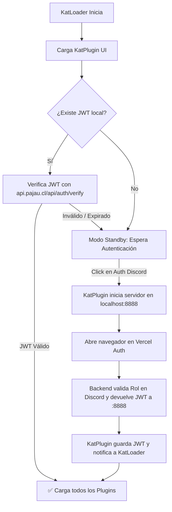
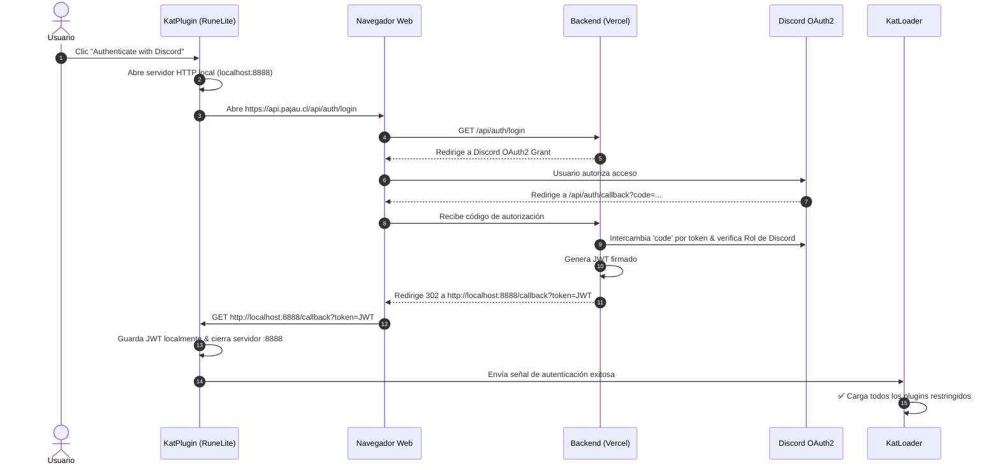

# 🛡️ KatLoader & KatPlugin — RuneLite Plugin Authentication System

Documentación técnica y flujo de arquitectura para el sistema de carga y autenticación OAuth2 de plugins para RuneLite (`KatLoader` + `KatPlugin`).

---

## 📌 Descripción General

El sistema se compone de dos módulos principales:
- **`KatLoader`**: Encargado de verificar las credenciales almacenadas (JWT) e inyectar/cargar el resto de los plugins en RuneLite.
- **`KatPlugin`**: Proporciona la interfaz gráfica (UI Panel) y gestiona el flujo interactivo de autenticación OAuth2 con Discord a través de un backend serverless en Vercel.

---

## Mi Wea

```
[KatLoader]       ---> carga KatPlugin
[KatLoader]       ---> revisa si tiene un JWT local, lo decodea y verifica con api.pajau.cl/api/auth/verify
    - Si no encontro JWT local o no fallo la verificacion queda esperando a authenticacion desde KatPlugin
    - Si encontro JWT y lo varifico correctamente -> Carga todos los plugins


[KatPlugin]
    [RuneLite Plugin] ---> crea un Panel con el estado de autehnticacion y plugins
    - Al hacer click en el boton de "Authenticar with discord"
        [RuneLite Plugin] ---> Abre servidor local en http://localhost:8888
        [RuneLite Plugin] ---> Abre navegador en https://api.pajau.cl/api/auth/login
        [Navegador]       ---> Redirige a Discord (OAuth2 Grant)
        [Discord]         ---> Devuelve 'code' a https://api.pajau.cl/api/auth/callback
        [Vercel Backend]  ---> Valida el 'code' y comprueba el Rol de Discord del usuario
        [Vercel Backend]  ---> Redirige el navegador a http://localhost:8888/callback con el resultado y el JWT
        [RuneLite Plugin] ---> Recibe la confirmación en el servidor local, codifica el JWT, lo guarda y manda la señal a KatLoader para cargar el resto de plugins.
```

---

## 🏗️ Flujo de Carga y Decisión (`KatLoader`)



---

## 🔄 Secuencia de Autenticación OAuth2 (Discord + Vercel)



---

## 📑 Detalle Paso a Paso del Workflow

### 1. Inicialización (`KatLoader`)
1. **Bootstrap**: `KatLoader` arranca y lanza la interfaz de `KatPlugin`.
2. **Verificación de Sesión**:
   * Busca un token JWT guardado localmente en el almacenamiento persistente de RuneLite.
   * **Con JWT local**: Envía una petición a `https://api.pajau.cl/api/auth/verify`.
     * **Respuesta exitosa**: Carga e inyecta inmediatamente todos los plugins de la colección.
     * **Respuesta fallida (o sin red)**: Elimina el token local e ingresa en modo de espera pasiva (*standby*).
   * **Sin JWT local**: Queda en *standby* esperando interacción del usuario desde el panel de `KatPlugin`.

### 2. Autenticación Interactiva (`KatPlugin`)
1. **Panel UI**: Muestra en la barra lateral el estado actual (*No Autenticado*).
2. **Acción**: El usuario hace clic en **"Authenticate with Discord"**.
3. **Servidor Local**: `KatPlugin` levanta un servidor HTTP embebido escuchando en `http://localhost:8888`.
4. **Login OAuth2**: Se abre el navegador predeterminado apuntando a `https://api.pajau.cl/api/auth/login`.
5. **Grant de Discord**: El usuario concede permisos en la plataforma de Discord.
6. **Callback Backend**: Discord redirige al endpoint de Vercel (`https://api.pajau.cl/api/auth/callback`) con el parámetro `code`.
7. **Validación de Rol (Vercel)**:
   * El backend procesa el `code` y consulta los datos del usuario en Discord.
   * Verifica que el usuario posea el **Rol de Discord requerido**.
   * Si la verificación es correcta, emite un token JWT.
8. **Handshake Local**: El backend redirige el navegador a `http://localhost:8888/callback?token={JWT}`.
9. **Finalización**:
   * `KatPlugin` captura la petición HTTP `/callback`, extrae el JWT y lo almacena en disco.
   * Apaga el servidor local `:8888`.
   * Envía una señal interna a `KatLoader` para completar la carga del resto de los plugins.

---

## 📌 Tabla de Referencia de Endpoints

| Componente / Endpoint | Método | Descripción / Función |
| :--- | :--- | :--- |
| `http://localhost:8888/callback` | `GET` | Listener local en RuneLite para capturar el token JWT. |
| `https://api.pajau.cl/api/auth/login` | `GET` | Endpoint inicial que redirige al flujo OAuth2 de Discord. |
| `https://api.pajau.cl/api/auth/callback` | `GET` | Procesa el `code` de Discord, valida roles de usuario y emite el JWT. |
| `https://api.pajau.cl/api/auth/verify` | `POST/GET` | Endpoint de verificación del JWT almacenado localmente. |

---

## 🛠️ Manejo de Excepciones y Casos Borde

- **Puerto 8888 Ocupado**: Si el puerto `:8888` está en uso por otra aplicación, el plugin intenta binding en puertos secundarios (`8889`, `8890`) o habilita una casilla para pegado manual del JWT.
- **Fallo de Red en /verify**: Si el backend de verificación no responde, los plugins permanecerán bloqueados en modo seguro y el panel de UI ofrecerá la opción de reintentar.
- **Revocación de Rol en Discord**: Si al usuario se le retira el rol en Discord, la siguiente comprobación en `/verify` fallará y requerirá un nuevo flujo de login.

---

